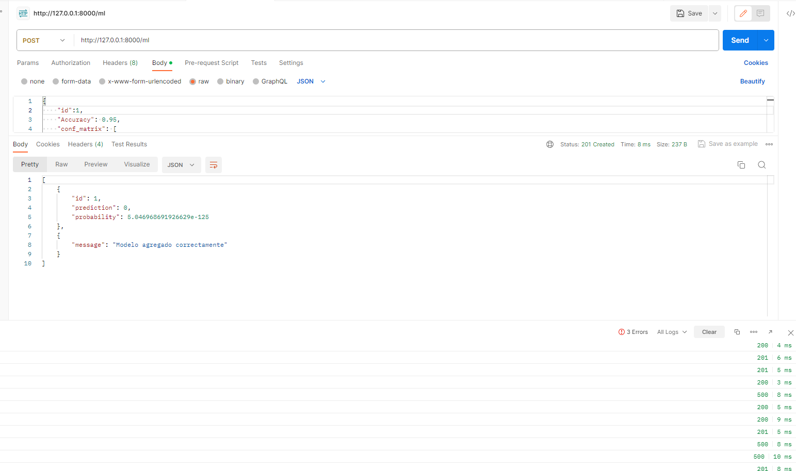
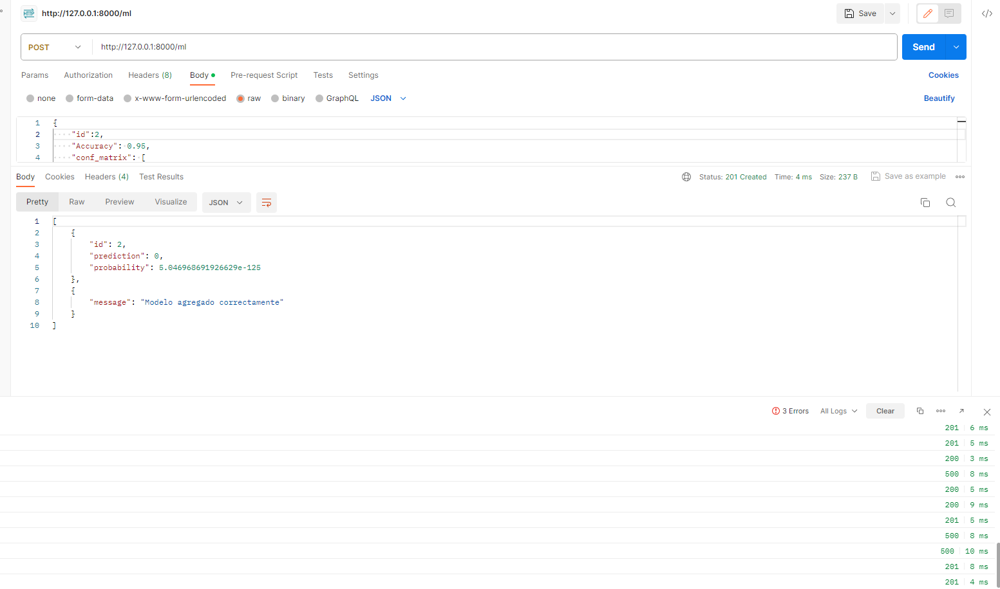
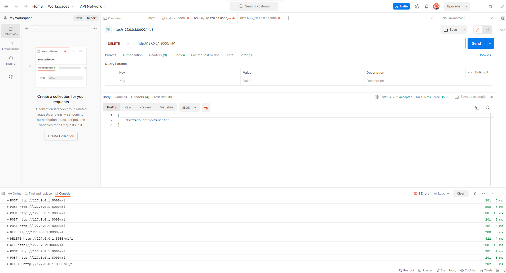
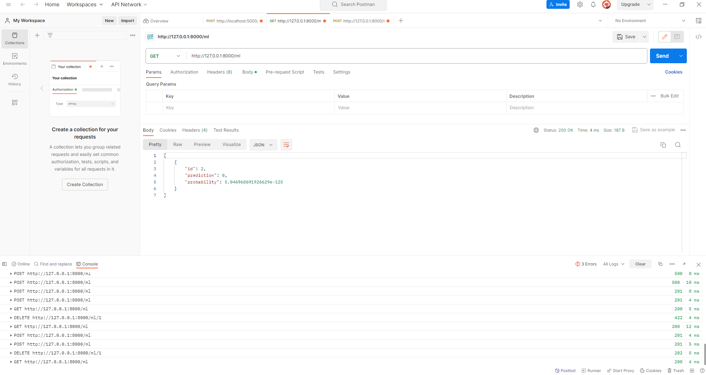

## API de Regresión Logística

Esta es una API desarrollada con FastAPI que proporciona operaciones CRUD (crear, leer, eliminar) para Regresión Logística.

### Endpoints

- **GET** /ml: Obtiene diccionario
- **POST** /ml: Crea una crea un resultado de regresion logística.
- **DELETE** /ml/{pred_id}: Elimina una resultado de la predicción del modelo de regresión Logística.

### Estructura del Proyecto

El proyecto sigue la siguiente estructura:

- main.py: Archivo principal de la aplicación FastAPI que inicia el servidor y configura los enrutadores.
- models.py: Contiene las definiciones de los modelos de datos utilizados en la API, como la clase Values.
- routes.py: Contiene la configuración de las rutas (endpoints) de la API utilizando el enrutador de FastAPI.
- controllers.py: Contiene la lógica de controladores para manejar las operaciones CRUD relacionadas con las estrellas pulsar.
- appy.py:Es mi modelo de Regresion Logistica ya guardado y para que sea cargado con la libreria pickle

### Ejecución

Para ejecutar la API en el puerto 8080, sigue los siguientes pasos:

1. Asegúrate de tener Python 3.x instalado en tu sistema.

2. Opcional: Si quieres crear un ambiente virtual

   `python -m venv venv`

3. Instala las dependencias ejecutando:
   `pip install -r requirements.txt.`
4. Ejecuta el siguiente comando en la raíz del proyecto:
   `uvicorn main:app --reload --port 8080`
5. Ahora con [Postman](https://www.postman.com/downloads/) podras consumir la api, como por ejemplo:
   
   
   
   
   
